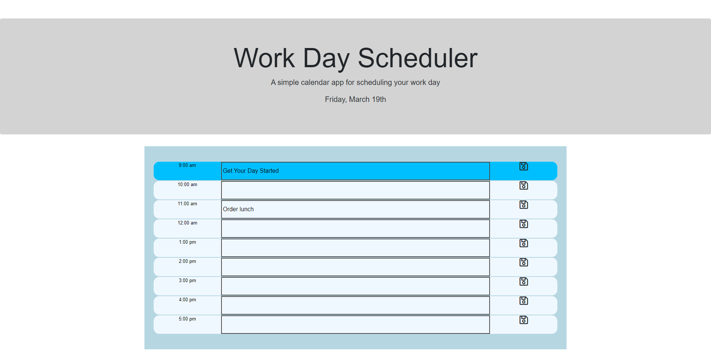
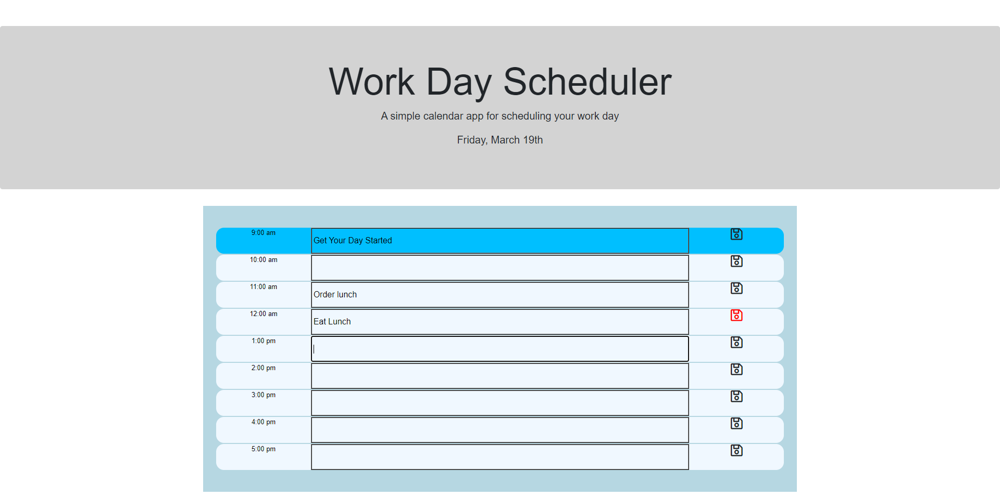
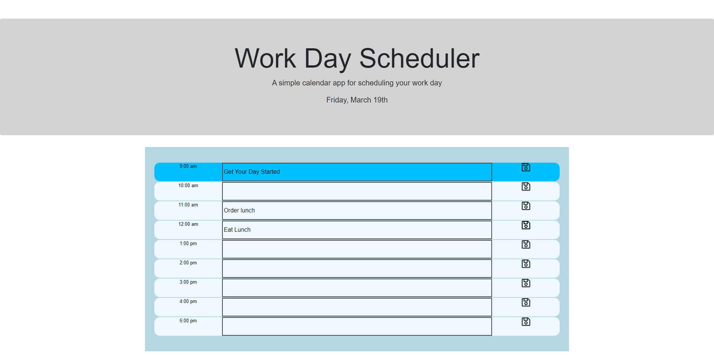

# Third Party APIs: Work Day Scheduler

## Description

This project was to build a web app that will feature dynamically updated HTML and CSS powered by jQuery. The app is a simple calendar that allows a user to save events for each hour of the day.

```md
The app should operate within the following requirements:
1. The current day is displayed at the top of the calendar.
2. The user should be presented with timeblocks for standard business hours.
    * Define the starting and ending hours in variables.
3. The timeblocks should be color coded to indicate whether it is in the past present, or future.
4. The user can click into a timeblock.
    * The user can enter a new event.
    * The user can change an event.
5. When a event is entered or changed the save image changes color to remind the user to click on save.
6. The user saves the event by clicking on the corresponding save image.
    * The event is saved to local storage and will be displayed on subsequent page loads.
    * The color of the save image reverts back to the standard color to indicate the save completed.
```
## Table of Contents

* [Installation](#installation)
* [Usage](#usage)
* [Credits](#credits)
* [License](#license)
* [Badges](#badges)
* [Features](#features)
* [Contributing](#contributing)
* [Tests](#tests)


## Installation

```md
The following steps should be used to install:
1. Push code to GitHub repository
    * git add -A
    * git committ -m "descriptive message"
    * git push
2. Select the Settings in GitHub
    * Scroll down to the GitHub Pages section
    * Under Source select to use main branch as source
```

## Usage 

Navigate to:
[https://markhatthorinc.github.io/05-Third-Party-APIs/](https://markhatthorinc.github.io/05-Third-Party-APIs/)

**Images of App:**





## Credits

Trilogy Education Services, LLC, a 2U, Inc. brand


## License

MIT License

Copyright (c) 2021 Mark S. Harrison

Permission is hereby granted, free of charge, to any person obtaining a copy
of this software and associated documentation files (the "Software"), to deal
in the Software without restriction, including without limitation the rights
to use, copy, modify, merge, publish, distribute, sublicense, and/or sell
copies of the Software, and to permit persons to whom the Software is
furnished to do so, subject to the following conditions:

The above copyright notice and this permission notice shall be included in all
copies or substantial portions of the Software.

THE SOFTWARE IS PROVIDED "AS IS", WITHOUT WARRANTY OF ANY KIND, EXPRESS OR
IMPLIED, INCLUDING BUT NOT LIMITED TO THE WARRANTIES OF MERCHANTABILITY,
FITNESS FOR A PARTICULAR PURPOSE AND NONINFRINGEMENT. IN NO EVENT SHALL THE
AUTHORS OR COPYRIGHT HOLDERS BE LIABLE FOR ANY CLAIM, DAMAGES OR OTHER
LIABILITY, WHETHER IN AN ACTION OF CONTRACT, TORT OR OTHERWISE, ARISING FROM,
OUT OF OR IN CONNECTION WITH THE SOFTWARE OR THE USE OR OTHER DEALINGS IN THE
SOFTWARE.

## Badges


## Features

There are no special features on this page.

## Contributing


## Tests

```md
Verify links work:
1. Click on _Event Section_
2. You should be able to enter or modify an event
3. Once you _tab_ out of the event section the _Save Image_ should turn red
4. Clicking on the red _Save Image_ will store the event in local storage and will return the color of the _Save Image_ to black.
```

```md
Verify page layout and that all images display.
```
